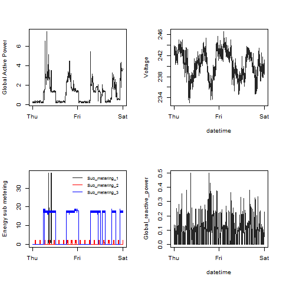

## Introduction

This assignment uses data from
the <a href="http://archive.ics.uci.edu/ml/">UC Irvine Machine
Learning Repository</a>, a popular repository for machine learning
datasets. In particular, we will be using the "Individual household
electric power consumption Data Set" which I have made available on
the course web site:

* <b>Dataset</b>: <a href="https://d396qusza40orc.cloudfront.net/exdata%2Fdata%2Fhousehold_power_consumption.zip">Electric power consumption</a> [20Mb]

* <b>Description</b>: Measurements of electric power consumption in
one household with a one-minute sampling rate over a period of almost
4 years. Different electrical quantities and some sub-metering values
are available.

The following descriptions of the 9 variables in the dataset are taken
from
the <a href="https://archive.ics.uci.edu/ml/datasets/Individual+household+electric+power+consumption">UCI
web site</a>:

<ol>
<li><b>Date</b>: Date in format dd/mm/yyyy </li>
<li><b>Time</b>: time in format hh:mm:ss </li>
<li><b>Global_active_power</b>: household global minute-averaged active power (in kilowatt) </li>
<li><b>Global_reactive_power</b>: household global minute-averaged reactive power (in kilowatt) </li>
<li><b>Voltage</b>: minute-averaged voltage (in volt) </li>
<li><b>Global_intensity</b>: household global minute-averaged current intensity (in ampere) </li>
<li><b>Sub_metering_1</b>: energy sub-metering No. 1 (in watt-hour of active energy). It corresponds to the kitchen, containing mainly a dishwasher, an oven and a microwave (hot plates are not electric but gas powered). </li>
<li><b>Sub_metering_2</b>: energy sub-metering No. 2 (in watt-hour of active energy). It corresponds to the laundry room, containing a washing-machine, a tumble-drier, a refrigerator and a light. </li>
<li><b>Sub_metering_3</b>: energy sub-metering No. 3 (in watt-hour of active energy). It corresponds to an electric water-heater and an air-conditioner.</li>
</ol>

## Loading the data

* The dataset has 2,075,259 rows and 9 columns. 

* We will only be using data from the dates 2007-02-01 and
2007-02-02. The data is read from just those dates
rather than reading in the entire dataset and subsetting to those
dates.

* Note that in this dataset missing values are coded as `?`.

## Making Plots

Four scripts are provided to construct each of the four plots included
in this document. Each plot is saved as a PNG file with a width of 480 
pixeles and a height of 480 pixeles.

### Plot 1

The script file to generate this plot is plot1.R
To run this sript, you should source in R using the command
source("plot1.R")

_>Original plot<_
 

->Resulting plot!<-
 
___
### Plot 2

The script file to generate this plot is plot2.R
To run this sript, you should source in R using the command
source("plot2.R")

->Original plot!<-
 

->Resulting plot!<-
 
___
### Plot 3

The script file to generate this plot is plot3.R
To run this sript, you should source in R using the command
source("plot3.R")

->Original plot!<-
 

->Resulting plot!<-
 
___
### Plot 4

The script file to generate this plot is plot4.R
To run this sript, you should source in R using the command
source("plot4.R")

->Original plot!<-
 

->Resulting plot!<-
 